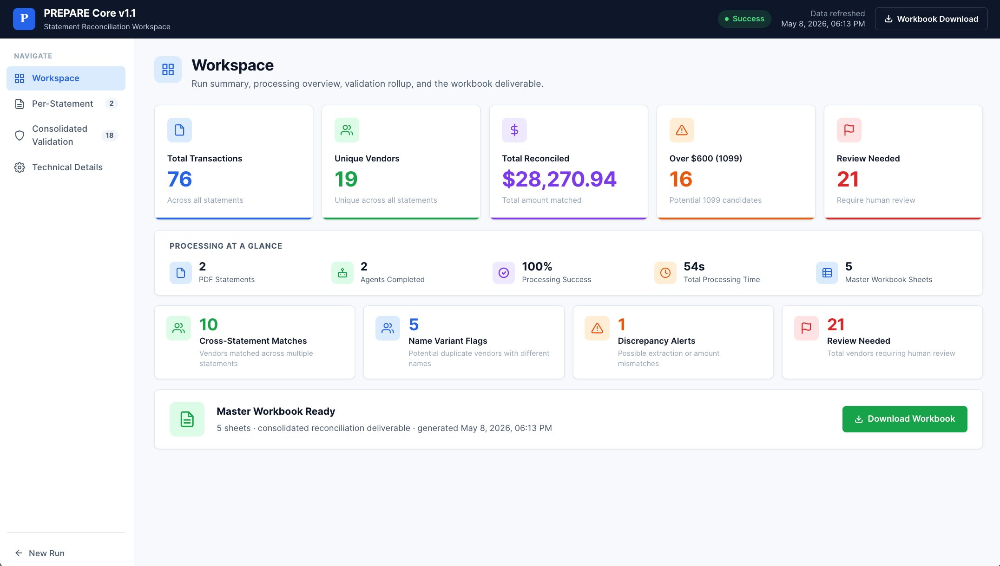
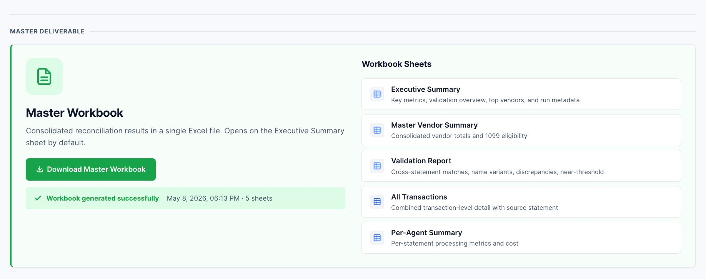
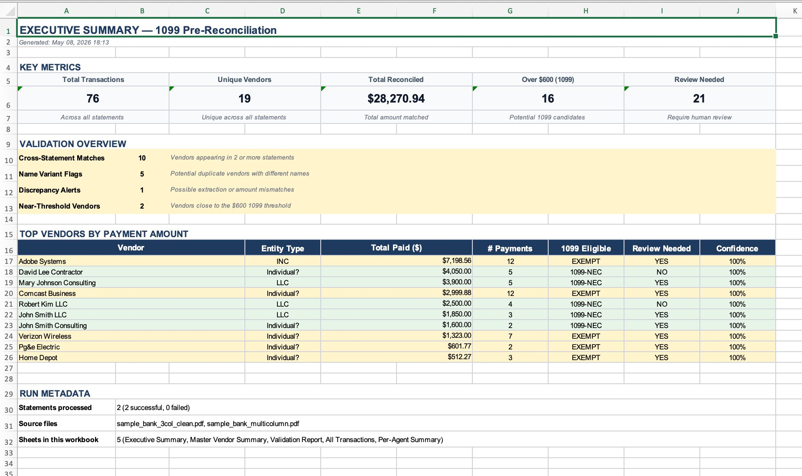

# PREPARE Core v1.1

**Statement Reconciliation Workspace**

PREPARE Core is an AI-assisted statement reconciliation workspace. It takes one or more bank or credit card statement PDFs, extracts and normalizes vendor payments, performs cross-statement validation, and produces an accountant-grade Excel workbook designed for 1099 pre-reconciliation review.

The v1.1 release is a focused refactor of an earlier experimental prototype. The scope has been narrowed from "general AI tax assistant" to a single, opinionated workflow: **multi-statement PDF in → reconciled Excel workbook out**, with a workspace UI for human review in between.



---

## Why This App Exists

Year-end 1099 preparation typically requires reconciling vendor payments across multiple bank and credit card statements. The manual process is repetitive: open each PDF, identify which transactions correspond to the same vendor under different name variants ("Verizon Wireless" vs "VERIZON WIRELESS LLC"), aggregate per-vendor totals, flag vendors crossing the $600 1099 threshold, and check for extraction or naming inconsistencies that could distort the totals.

PREPARE Core automates the mechanical parts of that workflow while keeping a human accountant in the review loop. It produces a structured workbook that reflects what an accountant would build by hand — but with cross-statement validation surfaced explicitly rather than discovered by chance.

This is a **portfolio project demonstrating an end-to-end AI-assisted document workflow**, not a production tax tool. See *Known Limitations / Future Work* below.

---

## Current v1.1 Workflow

1. **Upload** — one or more statement PDFs (1–10 per run), optional known-vendor CSV
2. **Per-statement processing** — rule-based, AI-assisted (single agent), or multi-agent extraction
3. **Vendor normalization** — fuzzy-match raw transaction descriptions against a canonical vendor list
4. **Aggregation** — per-vendor totals, transaction counts, first/last payment dates
5. **Cross-statement validation** — cross-statement matches, name variants, discrepancy alerts, near-threshold vendors
6. **Master workbook generation** — 5-sheet consolidated Excel deliverable
7. **Workspace review** — landscape-oriented UI for accountant review across four dedicated views

---

## Key Features

- **Three processing engines.** Rule-based (fast, free, deterministic), AI-assisted (single-agent extraction with Claude), or multi-agent (parallel per-statement agents with cross-validation).
- **Persistent vendor identity across statements.** A vendor appearing as "ADOBE SYSTEMS INC" in one PDF and "Adobe" in another is unified into a single canonical entity.
- **Cross-statement validation surface.** Combined-only $600 threshold crossings, name-variant duplicates, suspicious amount discrepancies (e.g., a 6.0× variance between statements), and near-threshold vendors that warrant pre-filing review.
- **Color-coded review queue.** Per-statement cards default-collapsed but informative; expandable for review reason tags, near-threshold detail, name variants, and discrepancy tables.
- **Excel deliverable that opens on Executive Summary.** KPI tiles, validation overview, top vendors by amount, and run metadata — designed so the accountant sees the headline before any individual sheet.
- **Schema-versioned API contract** between the FastAPI backend and the frontend. The frontend logs a console warning if the schema version drifts.
- **Hash-based SPA routing** — direct URLs to specific views (`/#workspace`, `/#per-statement`, `/#consolidated`, `/#technical`) with browser back/forward support.

---

## Architecture

```
┌─────────────────────────────────────────────────────────────┐
│  Frontend (single-page app, no build step)                  │
│  index.html — vanilla HTML/CSS/JS, hash-based routing       │
└──────────────────────────┬──────────────────────────────────┘
                           │ POST /api/process
                           │ GET  /api/download/{file_id}
┌──────────────────────────┴──────────────────────────────────┐
│  FastAPI server (server.py)                                 │
│  - dispatches to chosen engine                              │
│  - runs deterministic validation                            │
│  - generates master workbook                                │
│  - returns ProcessResponse (Pydantic-validated)             │
└──────────────────────────┬──────────────────────────────────┘
                           │
        ┌──────────────────┼──────────────────────┐
        ▼                  ▼                      ▼
┌───────────────┐  ┌────────────────┐  ┌──────────────────┐
│  agent_app.py │  │ backend/       │  │ master_excel_    │
│  rule_based / │  │ - pdf extract  │  │ generator.py     │
│  ai_assisted /│  │ - vendor       │  │ - 5-sheet xlsx   │
│  multi_agent  │  │   normalizer   │  │ - openpyxl       │
└───────────────┘  │ - aggregator   │  └──────────────────┘
                   │ - review flag  │
                   │   engine       │
                   │ - validation   │
                   │   engine       │
                   │ - 1099 class.  │
                   └────────────────┘
```

**Schema contract (`schemas.py`).** The `ProcessResponse` Pydantic model defines the full response shape. The frontend renders strictly against this schema and reports drift via console warning. `SCHEMA_VERSION = "1.0"`.

**Internal vs user-facing labels.** Internally, statements are tracked by a UUID-based `file_id`. A per-run `filename_map` resolves these to original filenames at the response boundary and inside the workbook, so users only ever see readable names like `sample_bank_3col_clean.pdf`.

---

## Frontend Views

The UI is a single-page app with hash-based routing. After processing, the sidebar appears with four navigable views.

### 1. Workspace
Run-level summary: 5 KPI cards (Total Transactions, Unique Vendors, Total Reconciled, Over $600, Review Needed), a Processing-at-a-Glance strip, 4 validation overview tiles, and a Master Workbook Ready CTA.

### 2. Per-Statement Review
One large card per processed statement, default-collapsed but informative (5 metrics + a templated review summary sentence visible without expansion). Color cycles by agent (green / blue / purple / amber / navy). Sort by file name, review count, or total amount; Expand All toggle. Expanding a card reveals review reason tags, this-statement near-threshold vendors, possible extraction discrepancies, and name variants — all scoped to that statement.

### 3. Consolidated Validation & Workbook
Cross-statement validation surfaced as 4 summary tiles + 4 collapsible detail sections. Below a *Master Deliverable* divider, the master workbook block lives here as the run's primary output: Excel-icon CTA, success strip with timestamp and sheet count, and a Workbook Sheets panel listing all 5 sheets with descriptions.



### 4. Technical Details
Engine, extraction model, language, processing time, total tool calls, and total cost in USD.

---

## Master Workbook Output

5 sheets, in this order:

| # | Sheet | Contents |
|---|---|---|
| 1 | **Executive Summary** | KPI grid (Total Transactions, Unique Vendors, Total Reconciled, Over $600, Review Needed), validation overview counts, top 10 vendors by total amount, run metadata. Workbook opens on this sheet. |
| 2 | **Master Vendor Summary** | One row per vendor per statement, with cross-references to other statements. 13 columns including Total Paid, # Payments, 1099 Eligible, Match/Extraction Confidence, Review Reasons, Cross-Reference. Frozen first column. |
| 3 | **Validation Report** | Four sections: Cross-Statement Vendor Matches (with per-statement breakdown), Name Variant Flags, Discrepancy Alerts (variance ratios > 3× rendered bold red), Near-Threshold Vendors. |
| 4 | **All Transactions** | Combined transaction-level detail with source statement, raw description, canonical vendor, amount, exclusion flags. |
| 5 | **Per-Agent Summary** | Per-statement processing metrics: status, transaction count, total reconciled, tool calls, cost. |

**Formatting conventions:** soft-green fill for 1099-eligible rows, amber for review-needed, light blue for 1099-MISC, soft red border for failed/excluded. All sheets set to landscape with fit-to-1-page-wide print. Currency cells rounded to 2 decimals (a floating-point leak from earlier versions has been fixed — `87.43000000000001` no longer slips through).



---

## How to Run Locally

### Prerequisites
- Python 3.11+
- An Anthropic API key (only required for the `ai_assisted` and `multi_agent` engines; the `rule_based` engine works without one)
- Test PDFs of your own (sample files used during development are not committed to this repository)

### Setup

```bash
git clone <your-repo-url>
cd PREPARE_app_v.1.0

python3 -m venv venv
source venv/bin/activate

pip install -r requirements.txt

cp .env.example .env
# edit .env and set ANTHROPIC_API_KEY
```

### Run

```bash
uvicorn server:app --port 8003 --reload
```

Open `http://localhost:8003` in a browser.

### File layout

```
PREPARE_app_v.1.0/
├── agent_app.py              # engine dispatcher (rule_based / ai_assisted / multi_agent)
├── agent_tools.py            # tool definitions for the AI agents
├── schemas.py                # Pydantic response contract
├── server.py                 # FastAPI app
├── requirements.txt
├── .env.example
├── .gitignore
├── backend/
│   ├── pdf_extractor.py
│   ├── vendor_normalizer.py
│   ├── transaction_aggregator.py
│   ├── review_flag_engine.py
│   ├── validation_engine.py
│   ├── vendor_classifier_1099.py
│   ├── pipeline.py
│   ├── excel_generator.py            # per-statement workbooks
│   └── master_excel_generator.py     # 5-sheet master workbook
├── frontend/
│   └── index.html             # single-page app
└── docs/
    └── screenshots/           # README images
```

---

## Example Workflow

1. Open the app at `http://localhost:8003`
2. **Upload screen:** drop 2 statement PDFs on the left, optional vendor CSV on the right
3. Choose engine (default: multi-agent), language (default: English)
4. Click **Process Statements**
5. After 10–60 seconds, the workspace loads at `#workspace`
6. **Workspace view:** confirm the headline numbers (transactions, unique vendors, total reconciled, vendors over $600, vendors needing review)
7. **Per-Statement view:** scan each statement card, expand any with high review counts
8. **Consolidated Validation view:** review cross-statement matches, name variants, discrepancy alerts (look for any bold-red high-variance rows), near-threshold vendors
9. Click **Download Master Workbook** → workbook opens on Executive Summary
10. Use the Excel workbook for the actual 1099 prep work; the web UI is for triage and validation review

---

## Known Limitations / Future Work

This project is honest about what it is: **a portfolio demonstration of an end-to-end AI-assisted document workflow, not a production tax tool.** The list below is what an accountant or engineer evaluating this for real use would identify as next steps.

### 1. Hashed filenames bleeding into Review Reasons
Some Review Reasons strings in the Master Vendor Summary still include internal UUID-style filenames (e.g., `bc0b7a18d5...pdf`) because those reason strings are constructed inside `review_flag_engine.py` before the filename map is available at the response boundary. The Validation Report sheet renders correctly because it goes through the resolver. Cleanup is planned in the next round alongside review-tag canonicalization (the prose strings will be replaced by short canonical tags that don't embed filenames at all).

### 2. Follow-up testing not yet complete
End-to-end testing has covered the happy-path 2-PDF case. Still pending:
- Failure-case test (corrupted PDF)
- Non-PDF upload test (e.g., uploading a CSV with a `.pdf` rename)
- 3-PDF multi-agent test (to exercise concurrency under the agent path)
- Rate-limit behavior (what happens when Anthropic returns 429 mid-run)
- Workbook generation failure behavior (does the `errors[]` channel surface it correctly to the UI)

### 3. Round 4 — Review tag canonicalization
The current Review Reasons column uses prose strings like `"Name variant detected — \"Mary Johnson Consulting\" in <hash>.pdf ~ \"John Smith Consulting\" in <hash>.pdf (73% similar)"`. These should be replaced by short canonical tags surfaced as chips in the UI:

- `Low vendor match confidence`
- `Name variant detected`
- `Near-threshold vendor`
- `Possible extraction discrepancy`
- `1099 review candidate`

The detail (similarity %, related vendor, etc.) moves to a structured `tags: list[Tag]` field with payloads, leaving the human-readable prose reason for tooltips and accessibility.

### 4. Model compatibility / cross-validation blur
The recommended stable extraction model is **Claude Haiku**, which is also the default. Sonnet and Opus may work for per-statement extraction, but model switching can affect downstream consolidated validation — larger models may interpret vendor names or transaction structures differently, leading to inconsistent name-variant detection or eligibility classification across runs that mix models. Sonnet/Opus should be treated as **advanced experimental overrides** until a consistency-testing pass is done. This is exposed in the UI behind an "Advanced (extraction model override)" disclosure with a warning.

### 5. Language scope
The current language dropdown lists 9+ options but the system prompt-pass-through is a no-op — extracted statement text and workbook data remain in source language. A more honest scope for the next pass would be **bilingual English / Korean**: English as the default U.S. accounting workflow language, Korean for selected UI guidance and demo presentation. Other locales should be removed until they're meaningfully implemented.

### 6. Production hardening not yet done
- No authentication / multi-tenancy
- No persistent storage — runs live in memory + on-disk under `outputs/run_<id>/`; clearing the directory loses history
- No audit trail of edits or human overrides
- CORS is currently `allow_origins=["*"]` for ease of local development

---

## Tech Stack

- **Python 3.11+**
- **FastAPI** — API layer
- **Pydantic 2.x** — schema contract enforcement (`schemas.py`)
- **Anthropic Claude API** via the Claude Agent SDK — agentic statement processing (Haiku default; Sonnet / Opus available as overrides)
- **pdfplumber** — PDF text + table extraction
- **openpyxl** — Excel workbook generation
- **Vanilla HTML / CSS / JavaScript** — frontend (single file, no build step, no framework)
- **uvicorn** — ASGI server

---

## Portfolio Notes

This project demonstrates several patterns that may be relevant to roles involving AI-assisted product workflows:

- **End-to-end pipeline, not a chatbot wrapper.** Multi-stage flow: extract → normalize → aggregate → validate → present. AI is one stage, not the whole product.
- **Schema-first contract between backend and frontend.** Pydantic `ProcessResponse` defines the wire format; the frontend renders strictly against it and warns on schema-version drift.
- **Three engine modes (rule-based, single-agent, multi-agent) sharing a single response contract.** Lets a user pick speed/cost/accuracy tradeoffs without changing the consuming UI.
- **Cross-document validation as an explicit deliverable.** Many AI document tools process documents in isolation; here the value comes from comparing across documents (combined-threshold crossings, name variants, amount discrepancies).
- **Iterative refactor history visible in commits.** v1.0 was a vertical results page; v1.1 reshaped the same backend into a workspace UI with hash-based routing, sidebar navigation, and a 5-sheet Excel deliverable. The refactor process itself is part of what the project demonstrates.

---

## License & Reuse

All rights reserved. This repository is published for portfolio review and is not licensed for reuse, redistribution, or derivative works at this time. If you'd like to use any part of it, please reach out.

---

## Acknowledgments

Built on top of [FastAPI](https://fastapi.tiangolo.com/), [Pydantic](https://docs.pydantic.dev/), [pdfplumber](https://github.com/jsvine/pdfplumber), [openpyxl](https://openpyxl.readthedocs.io/), and the [Anthropic Claude API](https://docs.claude.com/).
